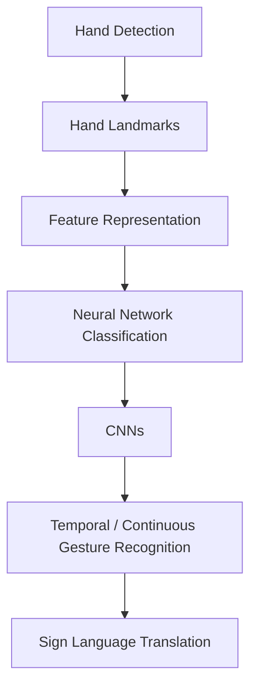

# 🤟 Sign Language Translator

A real-time Sign Language Translator built with **computer vision**, **hand landmark detection**, and **machine learning**.

---

## 📖 Overview

This project explores how computer vision and machine learning can be used to recognize, and eventually translate, **American Sign Language (ASL)**.

It is developed incrementally, starting with hand landmark detection and progressing toward neural-network-based recognition and continuous gesture understanding.

---

## 🚀 Current Progress

### Week 1 — Hand Landmarks + Feature Extraction

- Introduced **OpenCV** for image and video processing
- Used **MediaPipe** for hand landmark detection
- Detected **21 landmarks** per hand
- Explored the `x`, `y`, `z` coordinates of each landmark
- Implemented basic gesture detection using landmark-based rules

### Week 2 — Neural Networks + CNNs

- Introduced artificial neurons and neural networks
- Learned about weights and biases
- Studied activation functions: **ReLU**, **Sigmoid**, **Tanh**
- Studied **Softmax** and **cross-entropy loss**
- Learned gradient descent and backpropagation
- Learned about training and validation
- Implemented a basic fully-connected neural network in **PyTorch**, using MediaPipe hand landmarks as input features
- Introduced **Convolutional Neural Networks (CNNs)**: convolution, pooling, flattening, and dense layers

---

## 🗂️ Project Structure

```
Sign-Language_translator/
├── notebooks/
│   ├── opencv.ipynb
│   ├── week1.ipynb
│   ├── week2.ipynb
│   └── hands.jpg
├── src/
├── dataloader.py
├── requirements.txt
├── README.md
└── .gitignore
```

---

## 🛠️ Technologies

| Category        | Tools                    |
| --------------- | ------------------------ |
| Language        | Python                   |
| Computer Vision | OpenCV, MediaPipe        |
| Deep Learning   | PyTorch, Torchvision     |
| Data & Plotting | NumPy, Matplotlib        |
| Environment     | Jupyter                  |

---

## ⚙️ Setup

**1. Clone the repository**

```bash
git clone https://github.com/HiteshBajajft9/Sign-Language_translator.git
cd Sign-Language_translator
```

**2. Create and activate a virtual environment**

```bash
python3 -m venv venv
source venv/bin/activate
```

**3. Install dependencies**

```bash
pip install -r requirements.txt
```

### MediaPipe Model

> [!NOTE]
> The MediaPipe hand landmarker model is **not included** in this repository.
> Download `hand_landmarker.task` separately and place it in the project directory before running the relevant notebooks.

---

## 🧭 Learning Roadmap



---

## 🔮 Future Work

- [ ] Improve feature representation of hand landmarks
- [ ] Train models on a larger sign-language dataset
- [ ] Extend recognition beyond isolated/static gestures
- [ ] Incorporate temporal information from sequences of frames
- [ ] Explore RNNs/LSTMs for continuous gesture recognition
- [ ] Build a real-time sign-language translation pipeline

---

## 👥 Authors

- **Hitesh Bajaj**
- **Arnav Srivastava**
- **Priyanshu Srivastava**
